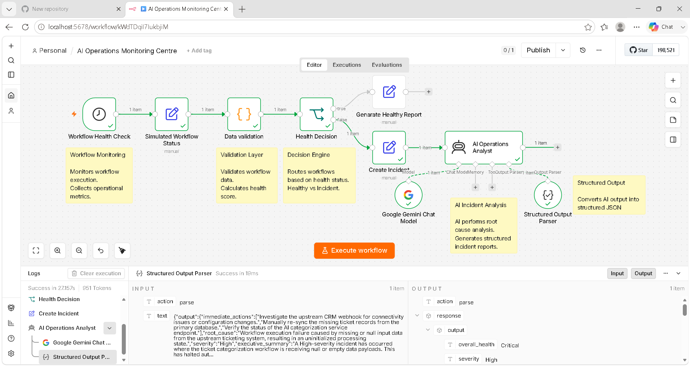
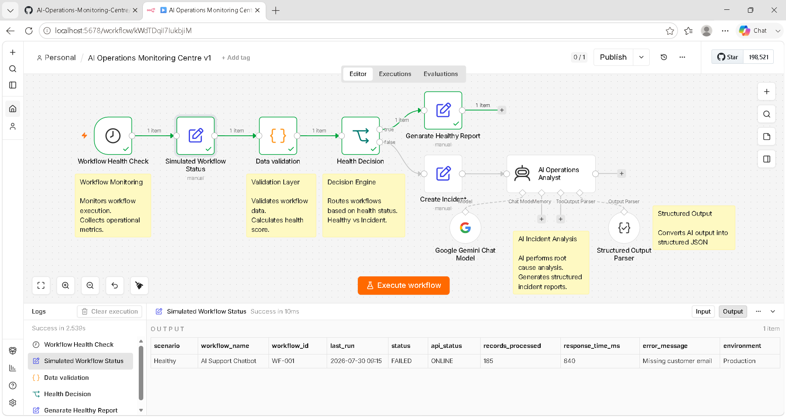
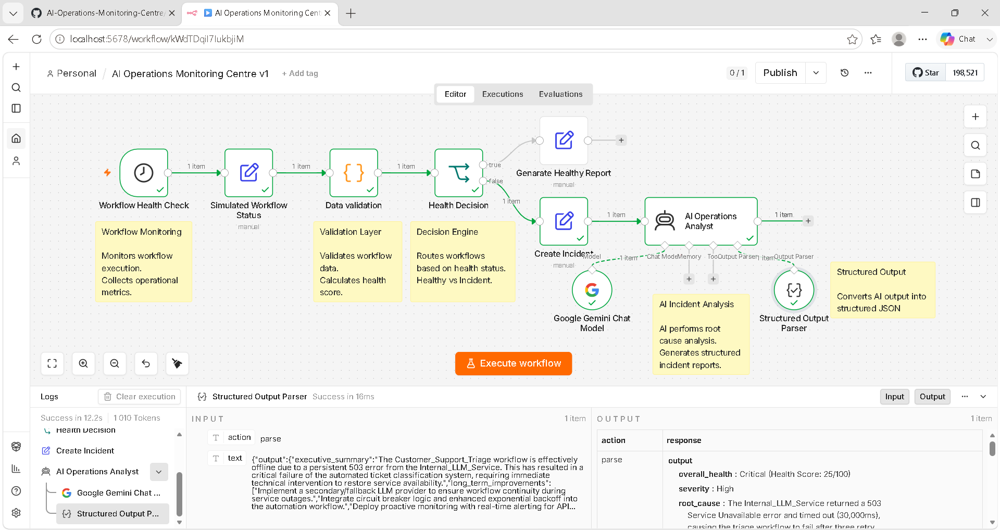
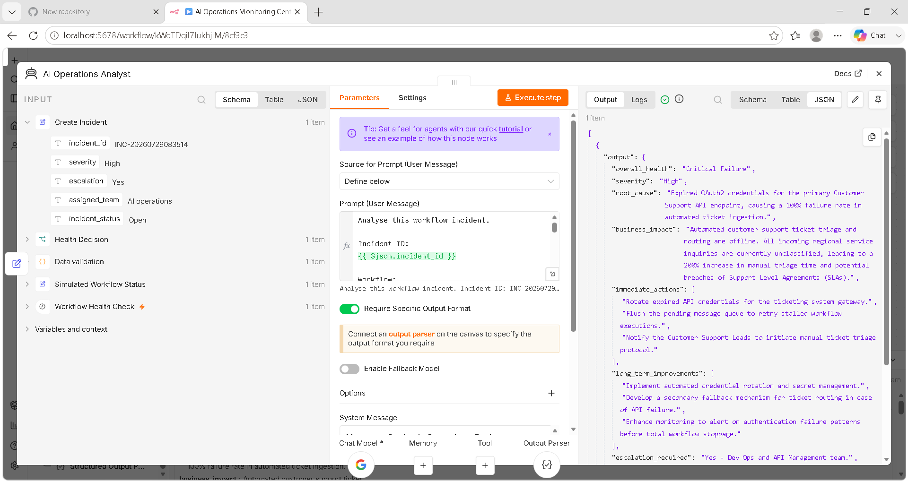
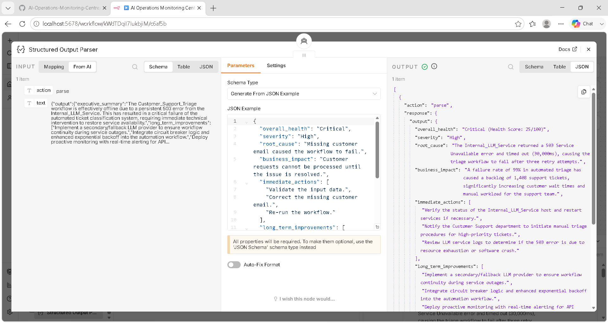
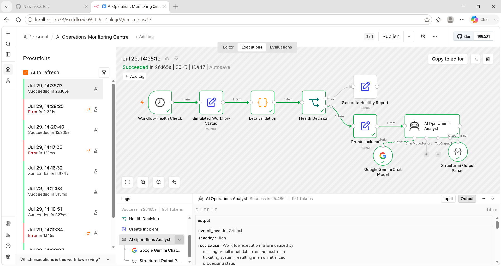

# AI Operations Monitoring Centre

> An AI-powered operational monitoring workflow built in **n8n** that automatically validates workflow health, detects failures, generates incidents, performs AI-driven root cause analysis, and produces structured operational reports.

---

## Overview

Modern operational environments generate thousands of workflow executions every day. Manually identifying failures, determining business impact, and producing incident reports is both time-consuming and error-prone.

This project demonstrates how Artificial Intelligence can be integrated into operational monitoring to automate incident detection and assist Operations Engineers with intelligent decision support.

Rather than replacing engineers, the workflow acts as an AI Operations Analyst capable of analysing workflow failures and generating structured operational reports suitable for ticketing systems, dashboards, or downstream automation.

---

## Workflow Overview

<p align="center">
    
</p>

---

## Features

- Automated workflow health monitoring
- Data validation layer
- Health scoring and decision engine
- Automatic incident generation
- AI-powered root cause analysis
- Business impact assessment
- Immediate remediation recommendations
- Long-term improvement suggestions
- Structured JSON output
- Production-ready workflow documentation

---

## Workflow Architecture

```
Workflow Trigger
        │
        ▼
Workflow Health Check
        │
        ▼
Simulated Workflow Status
        │
        ▼
Data Validation
        │
        ▼
Health Decision
      ┌──────┴──────┐
      │             │
Healthy         Critical
      │             │
Generate      Create Incident
Report             │
                   ▼
         AI Operations Analyst
                   │
                   ▼
        Structured Output Parser
                   │
                   ▼
          JSON Operational Report
```

---

# Workflow Components

| Component | Purpose |
|-----------|----------|
| Workflow Health Check | Collects operational workflow metrics |
| Simulated Workflow Status | Generates operational workflow data |
| Data Validation | Validates workflow input and calculates health score |
| Health Decision | Routes workflows to healthy or incident paths |
| Create Incident | Generates incident metadata |
| AI Operations Analyst | Performs AI-based operational analysis |
| Structured Output Parser | Produces structured JSON responses |

---

# Healthy Workflow

When a workflow passes validation and health checks, it follows the healthy path.

<p align="center">

</p>

The workflow generates a health report without creating an operational incident.

---

# Critical Workflow

When validation fails or operational thresholds are exceeded, the workflow automatically creates an incident.

<p align="center">

</p>

Incident metadata is forwarded to the AI Operations Analyst for investigation.

---

# AI Operations Analysis

Google Gemini analyses the operational incident and produces:

- Overall Health
- Severity
- Root Cause
- Business Impact
- Immediate Actions
- Long-Term Improvements
- Escalation Recommendation
- Executive Summary

<p align="center">

</p>

---

# Structured AI Output

The AI response is converted into structured JSON that can easily integrate with downstream systems.

<p align="center">

</p>

Example:

```json
{
  "overall_health": "Critical",
  "severity": "High",
  "root_cause": "Missing customer email caused workflow failure.",
  "business_impact": "Support requests cannot be processed.",
  "immediate_actions": [
    "Validate input data",
    "Correct customer email",
    "Restart workflow"
  ]
}
```

---

# Development & Testing

The workflow was developed using an iterative engineering approach.

Multiple execution scenarios—including healthy, warning, and critical workflow states—were tested to validate workflow logic, AI prompting, structured outputs, and incident generation.

The execution history below demonstrates the testing and refinement process used to build the final solution.

<p align="center">

</p>

---

# Repository Structure

```
AI-Operations-Monitoring-Centre/
│
├── docs/
│   ├── architecture.md
│   └── workflow-explanation.md
│
├── sample-data/
│   ├── healthy.json
│   ├── warning.json
│   ├── critical.json
│   └── README.md
│
├── screenshots/
│   ├── README.md
│   ├── 01-overview.png
│   ├── 02-healthy-path.png
│   ├── 03-critical-path.png
│   ├── 04-ai-analysis.png
│   ├── 05-structured-output.png
│   └── 06-executions.png
│
├── workflow/
│   ├── AI-Operations-Monitoring-Centre.json
│   └── workflow-diagram.png
│
├── README.md
├── LICENSE
└── .gitignore
```

---

# Skills Demonstrated

- AI Operations (AIOps)
- Workflow Automation
- n8n Development
- Prompt Engineering
- Google Gemini Integration
- Incident Management
- Operational Monitoring
- JSON Processing
- Data Validation
- Decision Automation
- Structured AI Outputs
- Root Cause Analysis
- Technical Documentation
- GitHub Portfolio Development

---

# Future Improvements

- Slack notifications
- Microsoft Teams integration
- ServiceNow ticket creation
- Jira integration
- Email alerts
- Grafana dashboard integration
- Prometheus metrics
- Real-time webhook monitoring

---

# Author

**Luthando Yekani**

Cybersecurity • Artificial Intelligence • Cloud • Automation

GitHub: https://github.com/LuthandoYekani

LinkedIn: https://www.linkedin.com/in/luthando-yekani-104a3b382
